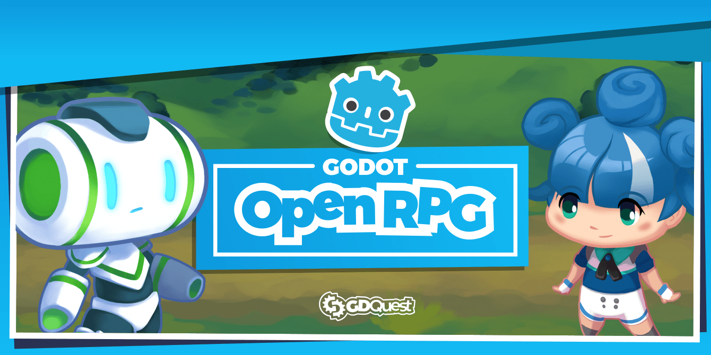

# Godot 4 Open RPG

OpenRPG is a a demo showing how to create a classical turn-based RPG in Godot 4. It's currently a work-in-progress.

**You need to use Godot 4.3 to open the project!** You can find Godot 4.3 on the [Godot website](https://godotengine.org/).

➡ Follow us on [Twitter](https://twitter.com/NathanGDQuest) and [YouTube](https://www.youtube.com/c/gdquest/) for Godot tips and tutorials! Get one of our [Godot game creation courses](https://www.gdquest.com/product/) to support our work on Free Software.

## Project Goal

The goal of this project is to provide the gamedev community with a demo that shows one solid way to create and structure the code for a 2D RPG in Godot 4. You can reuse the code in your own projects, and also learn from the project's codebase.

As we're teachers, our focus is on providing a learning resource that is both practical and educational. We're not trying to build a framework.

We're putting heavy emphasis on code that:

- Is updated to take advantage of what GDScript 4 has to offer.
- Is accessible to users with solid code foundations. It should be a good starting point and reference for those diving into an RPG project.
- Follows our [GDScript guidelines](https://gdquest.gitbook.io/gdquests-guidelines/godot-gdscript-guidelines).

## Our Mission

Together, we're creating a codebase and tools to show you some good Godot practices to create:

- Turn-based games.
- A combat system.
- An inventory system.
- Character progression.
- Maps with transitions, dialogues, grid-based movement, and more.
- User interface with multiple menus.

And more! Do you want to contribute and improve your programming skills with Godot? Check out the open issues, suggest improvements and report bugs by opening new ones, and be sure to check the contributing guidelines below.

## Credits

The project uses the asset pack [Tiny Town by Kenney](https://kenney.nl/assets/tiny-town).

## Contributing Guidelines

All contributors are welcome 🙂. To ensure a smooth and a productive experience for everyone working together, we came up with some guidelines we all follow here.

Check our [Contributors Guide](https://gdquest.gitbook.io/gdquests-guidelines/contributing-to-gdquest-projects/) for more information 😄
